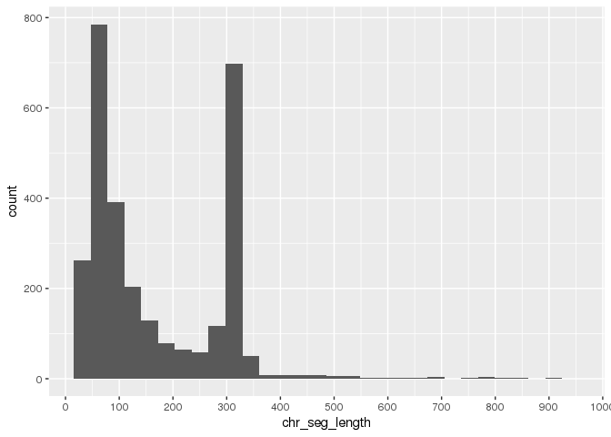
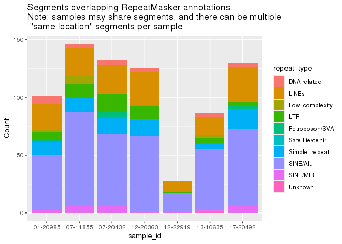
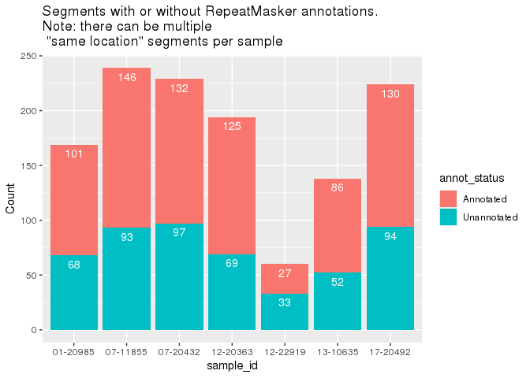

# Validate short SVs from Long Read MCL data
Sierra Gillis
2024-05-15

- [Goal](#goal)
- [Outline of process](#outline-of-process)
- [Background](#background)
  - [Alu Elements](#alu-elements)
- [Obtain data](#obtain-data)
  - [RepeatMasker reference files](#repeatmasker-reference-files)
  - [Segments of interest](#segments-of-interest)
- [Annotate segments of interest](#annotate-segments-of-interest)
  - [Plot annotated by type](#plot-annotated-by-type)
- [TO DO](#to-do)
- [Deprecated](#deprecated)
  - [Compare locations](#compare-locations)

    Error: package 'GenomeInfoDb' could not be loaded

# Goal

The last-dnarrange pipeline was used to call SVs from Long Read
(PromethION) data in 7 MCL cases. This pipeline outputs merged reads
that have sections mapping to multiple locations. There is a high
frequency of ~100 and ~300 bp regions within merged reads that map to
another chr/loc while the rest of the merged read resides in one
location. It is suspected that these short SVs correspond to STRs in the
~100 bp case and Alu repeats in the ~300 bp case. We are more interested
in Alu repeats at the moment.

This analysis aims to validate that these short SVs correspond to those
repetitive elements by performing the following checks - The SVs occur
at roughly the same locations across samples (various padding levels can
be used) - The sequences in these SVs correspond to the suspected
repetitive elements

# Outline of process

1.  Obtain dataframe of merged reads. If not already subset to these
    elements, subset.
2.  Annotate the SV with RepeatMasker reference; grouped boxplot per
    annotation type
3.  Compare start locations **across samples** with various levels of
    padding to see similarity

# Background

## Alu Elements

From Wikipedia for Alu element \> Two main promoter “boxes” are found in
Alu: a 5’ A box with the consensus TGGCTCACGCC, and a 3’ B box with the
consensus GTTCGAGAC

From
https://genomebiology.biomedcentral.com/articles/10.1186/gb-2011-12-12-236#Sec1

> The entire Alu element is flanked by direct repeats of variable length
> that are formed by duplication of the sequences at the insertion site.

I think these are the repreats that we are searching for within our
sequences.

From
https://www.pnas.org/doi/10.1073/pnas.92.18.8229#:~:text=The%20consensus%20sequences%20for%20the,specificities%20of%20retinoic%20acid%20receptors.

> The consensus sequences for the evolutionarily recent Alu subclasses
> contain three hexamer half sites, related to the consensus AGGTCA,
> arranged as direct repeats with a spacing of 2 bp, which is consistent
> with the binding specificities of retinoic acid receptors.

Another resource: https://www.ncbi.nlm.nih.gov/pmc/articles/PMC308866/

# Obtain data

## RepeatMasker reference files

These are in the GAMBL reference file.
`/projects/rmorin/projects/gambl-repos/gambl-sgillis/ref/lcr-modules-references-STABLE/genomes/hg38/repeatmasker/repeatmasker.hg38.bed`.
This shows a nice overview of the human genome and links
https://www.repeatmasker.org/species/hg.html.

From the reference files workflow
(`src/lcr-modules/workflows/reference_files/2.4/reference_files_header.smk`),
this is the source
http://www.repeatmasker.org/genomes/hg38/RepeatMasker-rm405-db20140131/hg38.fa.out.gz
. This was converted to bed with `rmsk2bed`. I believe this is a
`bedops` function.
https://bedops.readthedocs.io/en/latest/content/reference/file-management/conversion/rmsk2bed.html

> Note the conversion from 1- to 0-based coordinate indexing, in the
> transition from RepeatMasker annotation output to BED

Getting header info by downloading the .fa.out

       SW  perc perc perc  query      position in query           matching       repeat              position in  repeat
    score  div. del. ins.  sequence    begin     end    (left)    repeat         class/family         begin  end (left)   ID

This looks the same as in the bedops doc. That doc also describes the
column mapping

    chr start   stop    id  score   strand  %,substitutions %,deleted bases %,inserted bases    bases in query,past match   repeat class    Bases in complement of the repeat consensus sequence    match start match end   unique ID   higher-scoring match (optional)

Going to subset to the ones we are interested in, as we can always map
back: 1-6, 11. Keeps repeat class. Unfortunately we can’t remove the
score col bc we are using strand info which is expected to be in the 6th
col.

``` bash
cut -f1-6,11 /projects/rmorin/projects/gambl-repos/gambl-sgillis/ref/lcr-modules-references-STABLE/genomes/hg38/repeatmasker/repeatmasker.hg38.bed > repeatmasker_hg38_simplified.bed
```

## Segments of interest

Krysta has provided this dataframe
`/home/kcoyle/promethion_last_dnarrange_1kb_segs.tsv` which I have
copied and moved into the working directory:
`/projects/rmorin_scratch/sgillis_temp/MCL_long_read_SV/promethion_last_dnarrange_1kb_segs.tsv`.
Other info to note is the alignment was done with hg38
`/projects/rmorin/reference/igenomes/Homo_sapiens/GSC/GRCh38/Sequence/WholeGenomeFasta/GRCh38_no_alt.fa`.

``` r
segs_of_interest <- read_tsv("promethion_last_dnarrange_1kb_segs.tsv", show_col_types=FALSE)
dim(segs_of_interest)
```

    [1] 2915    9

There is also this explanation

> There are a few things to note: the strand is noted on the ‘read
> strand’ rather than the genomic sequence so there is a bit of
> finagling involved to use this file - I think you will need to use the
> read strand as the genomic strand and then add the seg width to the
> chr_start so that you read from the 3’ direction

This relates to how `read_strand` and `chr_strand` are not the same:

``` r
head(segs_of_interest)
```

| read_name  | read_strand | read_start | read_seg_length | chr   | chr_strand | chr_start | chr_seg_length | sample_id |
|:-----------|------------:|-----------:|----------------:|:------|-----------:|----------:|---------------:|:----------|
| merge21-4  |           1 |      15179 |             326 | chrX  |          1 |  66747347 |            326 | 01-20985  |
| merge22-3  |           1 |      49088 |             317 | chr3  |          1 |  52675833 |            317 | 01-20985  |
| merge27-12 |          -1 |      37753 |             307 | chr1  |          1 | 218612586 |            307 | 01-20985  |
| merge16-8  |          -1 |      35919 |             223 | chr10 |          1 |  21120269 |            217 | 01-20985  |
| merge38-12 |           1 |      37222 |              92 | chrX  |          1 | 114982105 |             96 | 01-20985  |
| merge44-11 |          -1 |      39167 |             289 | chr5  |          1 |  51289713 |            289 | 01-20985  |

If I am understanding this correctly, the `read_start` refers to where
this segment starts **in the read** and `chr_start` refers to the start
of this segment **in the reference**. So if the `read_strand` is
negative, then the sequence is 3’ starting at `chr_start` going to
`chr_start`-`chr_seg_length`? So after getting start and end for this
segment, we flip them to make it 5’ to 3’. E.g.

    read_seg_length read_strand chr_start
    10              -1          20

    3' start = 20, 3' end = 20-10 = 10
    5' start = 10, 5' end = 20

**Note:** Using `chr_seg_length` and `read_seg_length` as the reference
sequence is what we want to obtain, not the read sequence, since the
read is likely to have single base/short length errors in sequencing.

``` r
segs_correct_start <- segs_of_interest %>%
    mutate(start_5prime = case_when(
        read_strand == -1 ~ chr_start - chr_seg_length,
        read_strand == 1 ~ chr_start
    ),
    end_5prime = case_when(
        read_strand == -1 ~ chr_start,
        read_strand == 1 ~ chr_start + chr_seg_length
    ))
```

This will give us start and end coordinates to compare with padding. For
the analysis looking at the actual sequences for repetitive elements, we
may need to keep the orientation?

Double checking that this is correctly done - start \< end always - the
lengths should be the same

``` r
dim(segs_correct_start %>%  filter(start_5prime > end_5prime))[1] == 0
```

    [1] TRUE

``` r
dim(segs_correct_start %>% filter(chr_seg_length != (end_5prime - start_5prime)))[1] == 0
```

    [1] TRUE

Looks good.

First want to look at the distribution of segment lengths

``` r
segs_correct_start %>%
    ggplot(aes(x=chr_seg_length)) +
    geom_histogram() +
    scale_x_continuous(breaks=seq(0,1000,100))
```

    `stat_bin()` using `bins = 30`. Pick better value with `binwidth`.



I think for downstream annotation of these segments with repeatmasker
info, it makes sense to output this as a bedfile and use
`bedtools intersect` and the complement to get the non-overlapping. This
seems like a cleaner way to get the overlaps vs using GRanges objects
and `findOverlaps` which has output that’s harder to interpret. Just
need to be careful about coordinate indexing. We can also subset by
segment length at this stage, since we are particularly interested in
Alu repeats.

``` r
segs_to_bed <- segs_correct_start %>%
    filter(read_seg_length >=200) %>%
    mutate(score = 0) %>%
    mutate(strand = case_when(
        read_strand == 1 ~ "+",
        read_strand == -1 ~ "-"
    )) %>%
    select(chr, start_5prime, end_5prime, read_name, score, strand, sample_id) %>%
    arrange(chr, start_5prime, end_5prime)
dim(segs_to_bed)
```

    [1] 1075    7

Removed about two thirds.

``` r
write_tsv(segs_to_bed, "segs_of_interest.bed", col_names = FALSE)
```

# Annotate segments of interest

The next part will be done in bash, with my conda env `bed`. Use
`bedtools intersect` between the segments of interest and the
repeatmasker annotations, to get cols with all the info we want.
Particularly the `id` cols from both and the `repeat class` from repeat
masker. We will run in a mode that uses strand info. Since we aren’t
sure if the segments are in 0- or 1- based coordinates, I would like to
add at least 1 bp padding. Even if it only overlaps the annotation by 1
bp, I think that’s still useful. We can in the future adjust this
padding to see if more are captured.

Parameters

- `-a` input bed 1
- `-b` input bed 2
- `-wb` if I understand this correctly, it will keep the entry from
  input bed 1, and also write the entry for input bed 2 in subsequent
  cols
- `-s` force strandedness

``` bash
conda activate bed

bedtools intersect -s -wb -a segs_of_interest.bed -b repeatmasker_hg38_simplified.bed > segs_of_interest_annotated.bed
```

We can also create a file with the complement i.e. segments that do no
overlap with repeatmasker annotations.

``` bash
bedtools intersect -s -v -a segs_of_interest.bed -b repeatmasker_hg38_simplified.bed > segs_of_interest_no_annotation.bed
```

From quick line counts, there are 748 with annotations and 505 without.
748 + 505 = 1253 which is more than the original, because it could have
a one-to-many relationship if a segment overlaps multiple regions in the
repeatmasker bed. for example, the start of the segment overlaps one
repeat, the end of it overlaps another? I also wonder if the annotations
have multuiple per region, since the `bedops` doc specifically shows
doing a merge…

## Plot annotated by type

Reading in the annotated table so that we can plot the types of repeats

``` r
annotated_segs <- read_tsv("segs_of_interest_annotated.bed", col_names = c("chr", "start", "end", "read_name", "score", "strand", "sample_id", "rmsk_chr", "rmsk_start", "rmsk_end", "rmsk_id", "rmsk_score", "rmsk_strand","rmsk_class"), show_col_types = FALSE) %>%
    select(-score, -rmsk_score)
```

Grouping the repeat types into broader categories to show proportion
differences better in the plot below.

``` r
annotated_segs_rp_groups <- annotated_segs %>%
    mutate(repeat_type = case_when(
        str_detect(rmsk_class, "DNA") ~ "DNA related",
        str_detect(rmsk_class, "LINE") ~ "LINEs",
        str_detect(rmsk_class, "LTR") ~ "LTR",
        TRUE ~ rmsk_class
    ))
```

``` r
annotated_segs_rp_groups %>%
    group_by(sample_id, repeat_type) %>%
    summarize(Count = n()) %>%
    ggplot(aes(x=sample_id, y=Count, fill=repeat_type)) +
    geom_bar(position="stack", stat="identity") +
    ggtitle("Segments overlapping RepeatMasker annotations.\nNote: samples may share segments, and there can be multiple\n \"same location\" segments per sample")
```

    `summarise()` has grouped output by 'sample_id'. You can override using the
    `.groups` argument.



Getting count per sample

``` r
annotated_segs_rp_groups %>%
    group_by(sample_id) %>%
    summarize(n())
```

| sample_id | n() |
|:----------|----:|
| 01-20985  | 101 |
| 07-11855  | 146 |
| 07-20432  | 132 |
| 12-20363  | 125 |
| 12-22919  |  27 |
| 13-10635  |  86 |
| 17-20492  | 130 |

Plot proportions of annotated vs unannotated per sample. Read in
unannotated bed and add `NA` in cols unique to annotated, so that we can
combine them into one df.

``` r
unannotated_segs <- read_tsv("segs_of_interest_no_annotation.bed", col_names = c("chr", "start", "end", "read_name", "score", "strand","sample_id"), show_col_types = FALSE) %>%
    select(-score) %>%
    mutate(
        rmsk_chr = NA,
        rmsk_start = NA,
        rmsk_end = NA,
        rmsk_id = NA,
        rmsk_strand = NA,
        rmsk_class = NA,
        repeat_type = NA
    )
dim(unannotated_segs)
```

    [1] 506  13

Combine and add col for annotated vs unannotated.

``` r
all_segs_after_rmsk <- rbind(annotated_segs_rp_groups, unannotated_segs)

all_segs_after_rmsk <- all_segs_after_rmsk %>%
    mutate(annot_status = ifelse(is.na(rmsk_class), "Unannotated", "Annotated"))
```

Plotting proportion per sample

``` r
all_segs_after_rmsk  %>%
    group_by(sample_id, annot_status) %>%
    summarize(Count = n()) %>%
    ungroup() %>%
    group_by(sample_id) %>%
    arrange(sample_id, desc(annot_status)) %>%
    mutate(label_y = cumsum(Count)) %>%
    ggplot(aes(x=sample_id, y=Count, fill=annot_status)) +
    geom_bar(position="stack", stat="identity") +
    ggtitle("Segments with or without RepeatMasker annotations.\nNote: there can be multiple\n \"same location\" segments per sample") +
    geom_text(aes(y=label_y, label = Count), vjust = 1.5, colour = "white")
```

    `summarise()` has grouped output by 'sample_id'. You can override using the
    `.groups` argument.



# TO DO

- look at overlap between samples
- investigate those without annotation

# Deprecated

## Compare locations

I’m sure if we look for exact matching locations there won’t be any

``` r
same_start <- segs_correct_start %>%
    group_by(chr, start_5prime) %>%
    filter(n()>1) %>%
    arrange(chr, start_5prime) %>%
    ungroup()
```

There are 283 out of 2914 total. There are a few ways this can happen
(quick visual inspection showed some):

- within a sample, same segment length as well
- within a sample, different segment lengths
- across samples

I think the across sample ones are most interesting right now. We can
subset to these and show the distribution of segment lengths

``` r
same_start_diff_samples <- same_start %>%
    group_by(chr, start_5prime) %>%
    mutate(num_samples = n_distinct(sample_id)) %>%
    filter(num_samples > 1) %>%
    ungroup()

dim(same_start_diff_samples)
dim(same_start_diff_samples %>% select(sample_id) %>% unique())
```

So all the samples show up in this

Do any of these show up in ALL 7?

``` r
same_start_diff_samples %>% filter(num_samples == 7)
```

Whats the distribution of the number of samples like?

``` r
summary(same_start_diff_samples  %>% select(num_samples))
```

Max is 5! How many/which segments are those

``` r
same_start_diff_samples %>%
    filter(num_samples == 5)
```

Not sure how to move forward with the ones that have same start
**within** a sample. My instinct is to select one representative,
because otherwise the numbers could be skewed.

Looking at “overlapping” starts when there is various amount of padding.
I’d like to decide the padding based on the length of the segments. We
have a peak of segments around ~300 bp and another around ~75 (before
100 in the histogram). So making the percentages based on the 300 bp
ones. Arbitrarily choosing 1%, 5%, 10%, 25%, 50%, 75%, 100% for now.
This corresponds to padding of: 3, 15, 30, 75, 150, 225, 300.

Starting with just finding any overlap between these segments. I think
it’s best to do with the a genomic ranges object and compare only across
samples. We can create a genomic ranges list object that stores each of
the indivial genomic ranges object for each sample.

``` r
gr <- makeGRangesFromDataFrame(segs_correct_start %>% select(chr, start=start_5prime, end=end_5prime, sample_id), keep.extra.columns=TRUE)
gr_list <- split(gr, as.factor(gr$sample_id))
gr_list$`01-20985`
elementNROWS(gr_list)
```

The above show how many segments in each.

Just doing one comparison, for exploration of the GRanges obj and fns,
bc I can’t seem to find an existing function that will work for all the
objects in the list

``` r
findOverlaps(gr_list[[1]], gr_list[[2]], ignore.strand=TRUE)
```

The code below will compare a single one to all of them (including
itself unfortunately)

``` r
findOverlaps(gr_list, gr_list[[1]], ignore.strand=TRUE)
```

``` r
countOverlaps(gr_list, gr_list[[1]], ignore.strand=TRUE)
countOverlaps(gr_list, gr_list[[2]], ignore.strand=TRUE)
countOverlaps(gr_list, gr_list[[3]], ignore.strand=TRUE)
countOverlaps(gr_list, gr_list[[4]], ignore.strand=TRUE)
countOverlaps(gr_list, gr_list[[5]], ignore.strand=TRUE)
countOverlaps(gr_list, gr_list[[6]], ignore.strand=TRUE)
countOverlaps(gr_list, gr_list[[7]], ignore.strand=TRUE)
```

This is not symmetric? I wonder if it’s from the overlapping regions
**within** a sample. i.e. a many-to-one relationship

For example, sample1 has

    chr 1 10
    chr 1 5
    chr 1 11

sample2 has

    chr 1 10

Then comparing query=sample1, subject=sample2 there are 3 query hits and
1 subject hit. Comparing query=sample2, subject=sample1 there is one
query hit and 3 subject hits. And what is shown in `countOverlaps` is
query hits? Form the documentation:
`an integer vector containing the tabulated query overlap hits`. So
either way this table actually gives us both!

For better processing, should make it cols `query` `subject`
`query hits`.

Also, I think we want to look specifically at start position?

> The ‘maxgap’ parameter has special meaning with the special overlap
> types. For ‘start’, ‘end’, and ‘equal’, it specifies the maximum
> difference in the starts, ends or both, respectively. For ‘within’, it
> is the maximum amount by which the query may be wider than the
> subject.

This maxgap is what I can vary as a % seg length.

I should also be able to verify the numbers found before? At least
across samples, within samples will still show the total amount. So for
`01-20985` and `07-11855`

``` r
segs_correct_start %>%
    filter(sample_id %in% c("01-20985", "07-11855")) %>%
    group_by(chr, start_5prime) %>%
    mutate(num_samples = n_distinct(sample_id)) %>%
    filter(num_samples > 1) %>%
    arrange(chr,start_5prime)
```

So expect 3 between these two

``` r
countOverlaps(gr_list, gr_list[[1]], ignore.strand=TRUE, type="start")
countOverlaps(gr_list, gr_list[[2]], ignore.strand=TRUE, type="start")
countOverlaps(gr_list, gr_list[[3]], ignore.strand=TRUE, type="start")
countOverlaps(gr_list, gr_list[[4]], ignore.strand=TRUE, type="start")
countOverlaps(gr_list, gr_list[[5]], ignore.strand=TRUE, type="start")
countOverlaps(gr_list, gr_list[[6]], ignore.strand=TRUE, type="start")
countOverlaps(gr_list, gr_list[[7]], ignore.strand=TRUE, type="start")
```
